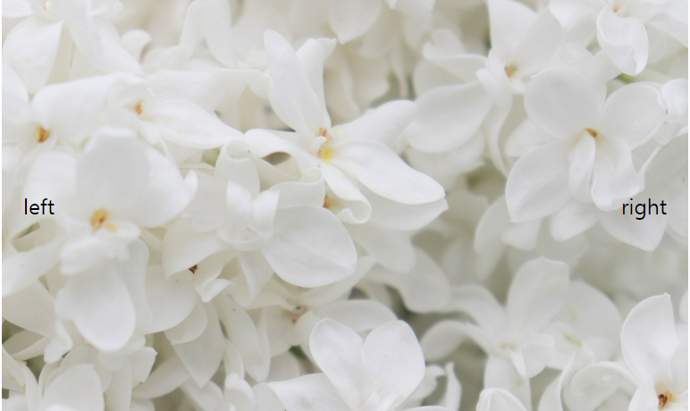
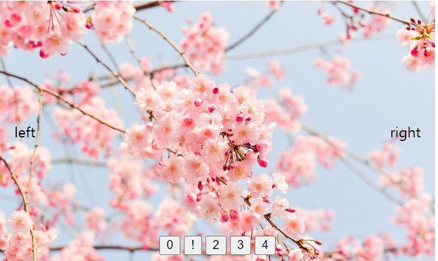

# Slider

**경로**

- src - App
- src - components - ImageSlider.jsx
- src - components - image-slider.css

<hr />

## V1

<div align="center"></div>

**App**

```
import img1 from './imgs/1.jpg';
import img2 from './imgs/2.jpg';
import img3 from './imgs/3.jpg';
import img4 from './imgs/4.jpg';
import img5 from './imgs/5.jpg';

import ImageSlider from './components/ImageSlider';

const IMAGES = [img1, img2, img3, img4, img5];

function App() {
  return (
    <div
      style={{
        maxWidth: '1200px',
        width: '100%',
        aspectRatio: '10 / 6',
        margin: '0 auto',
      }}
    >
      <ImageSlider imageUrls={IMAGES} />
    </div>
  );
}

export default App;
```

**ImageSlider.jsx**

```
import { useState } from 'react';

import './image-slider.css';

const ImageSlider = ({ imageUrls }) => {
  const [imageIndex, setImageIndex] = useState(0);

  const showPrevImage = () => {
    setImageIndex((index) => {
      if (index === 0) return imageUrls.length - 1;
      return index - 1;
    });
  };

  const showNextImage = () => {
    setImageIndex((index) => {
      if (index === imageUrls.length - 1) return 0;
      return index + 1;
    });
  };
  return (
    <div
      style={{
        width: '100%',
        height: '100%',
        position: 'relative',
      }}
    >
      
      <button
        onClick={showPrevImage}
        className="img-slider-btn"
        style={{ left: '0' }}
      >
        left
      </button>
      <button
        onClick={showNextImage}
        className="img-slider-btn"
        style={{ right: '0' }}
      >
        right
      </button>
    </div>
  );
};

export default ImageSlider;
```

**image-slider.css**

```
* {
  box-sizing: border-box;
}

.img-slider-img {
  object-fit: cover;
  width: 100%;
  height: 100%;
}

.img-slider-btn {
  all: unset;
  display: block;
  position: absolute;
  top: 0;
  bottom: 0;
  padding: 1rem;
  cursor: pointer;
  transition: background-color 100ms ease-in-out;
}

.img-slider-btn:hover {
  background-color: rgb(0, 0, 0, 0.2);
}

.img-silder-btn > * {
  stroke: white;
  fill: black;
  width: 2rem;
  height: 2rem;
}
```

## V2

<div align="center"></div>

**App**

```
import img1 from './imgs/1.jpg';
import img2 from './imgs/2.jpg';
import img3 from './imgs/3.jpg';
import img4 from './imgs/4.jpg';
import img5 from './imgs/5.jpg';

import ImageSlider from './components/ImageSlider';

const IMAGES = [img1, img2, img3, img4, img5];

function App() {
  return (
    <div
      style={{
        maxWidth: '1200px',
        width: '100%',
        aspectRatio: '10 / 6',
        margin: '0 auto',
      }}
    >
      <ImageSlider imageUrls={IMAGES} />
    </div>
  );
}

export default App;
```

**ImageSlider.jsx**

```
import { useState } from 'react';

import './image-slider.css';

const ImageSlider = ({ imageUrls }) => {
  const [imageIndex, setImageIndex] = useState(0);

  const showPrevImage = () => {
    setImageIndex((index) => {
      if (index === 0) return imageUrls.length - 1;
      return index - 1;
    });
  };

  const showNextImage = () => {
    setImageIndex((index) => {
      if (index === imageUrls.length - 1) return 0;
      return index + 1;
    });
  };
  return (
    <div
      style={{
        width: '100%',
        height: '100%',
        position: 'relative',
      }}
    >
      <div
        style={{
          width: '100%',
          height: '100%',
          display: 'flex',
          overflow: 'hidden',
        }}
      >
        {imageUrls.map((url) => (
          
        ))}
      </div>
      <button
        onClick={showPrevImage}
        className="img-slider-btn"
        style={{ left: '0' }}
      >
        left
      </button>
      <button
        onClick={showNextImage}
        className="img-slider-btn"
        style={{ right: '0' }}
      >
        right
      </button>
      <div
        style={{
          position: 'absolute',
          bottom: '.5rem',
          left: '50%',
          translate: '-50%',
          display: 'flex',
          gap: '.25rem',
        }}
      >
        {imageUrls.map((_, index) => (
          <button
            key={index}
            className="img-slider-dot-btn"
            onClick={() => setImageIndex(index)}
          >
            {index === imageIndex ? '!' : index}
          </button>
        ))}
      </div>
    </div>
  );
};

export default ImageSlider;
```

**image-slider.css**

```
* {
  box-sizing: border-box;
}

.img-slider-img {
  object-fit: cover;
  width: 100%;
  height: 100%;
  display: block;
  flex-shrink: 0;
  flex-grow: 0;
  transition: translate 300ms ease-in-out;
}

.img-slider-btn {
  all: unset;
  display: block;
  position: absolute;
  top: 0;
  bottom: 0;
  padding: 1rem;
  cursor: pointer;
  transition: background-color 100ms ease-in-out;
}

.img-slider-btn:hover {
  background-color: rgb(0, 0, 0, 0.2);
}

.img-slider-btn:hover > * {
  animation: squish 200ms ease-in-out;
}

.img-silder-btn > * {
  stroke: white;
  fill: black;
  width: 2rem;
  height: 2rem;
}

@keyframes squish {
  50% {
    scale: 1.4 0.6;
  }
}
```

## V3

**App**

```
import img1 from './imgs/1.jpg';
import img2 from './imgs/2.jpg';
import img3 from './imgs/3.jpg';
import img4 from './imgs/4.jpg';
import img5 from './imgs/5.jpg';

import ImageSlider from './components/ImageSlider';

const IMAGES = [
  { url: img1, alt: 'img One' },
  { url: img2, alt: 'img Two' },
  { url: img3, alt: 'img Three' },
  { url: img4, alt: 'img Four' },
  { url: img5, alt: 'img Five' },
];

function App() {
  return (
    <div
      style={{
        maxWidth: '1200px',
        width: '100%',
        aspectRatio: '10 / 6',
        margin: '0 auto',
      }}
    >
      <ImageSlider images={IMAGES} />
    </div>
  );
}

export default App;
```

**ImageSlider.jsx**

```
import { useState } from 'react';

import './image-slider.css';

const ImageSlider = ({ images }) => {
  const [imageIndex, setImageIndex] = useState(0);

  const showPrevImage = () => {
    setImageIndex((index) => {
      if (index === 0) return images.length - 1;
      return index - 1;
    });
  };

  const showNextImage = () => {
    setImageIndex((index) => {
      if (index === images.length - 1) return 0;
      return index + 1;
    });
  };
  return (
    <section
      aria-label="Image Slider"
      style={{
        width: '100%',
        height: '100%',
        position: 'relative',
      }}
    >
      <div
        style={{
          width: '100%',
          height: '100%',
          display: 'flex',
          overflow: 'hidden',
        }}
      >
        {images.map(({ url, alt }, index) => (
          
        ))}
      </div>
      <button
        onClick={showPrevImage}
        className="img-slider-btn"
        style={{ left: '0' }}
        aria-label="View Previous Image"
      >
        <span aria-hidden>left</span>
      </button>
      <button
        onClick={showNextImage}
        className="img-slider-btn"
        style={{ right: '0' }}
        aria-label="View Next Image"
      >
        <span aria-hidden>right</span>
      </button>
      <div
        style={{
          position: 'absolute',
          bottom: '.5rem',
          left: '50%',
          translate: '-50%',
          display: 'flex',
          gap: '.25rem',
        }}
      >
        {images.map((_, index) => (
          <button
            key={index}
            className="img-slider-dot-btn"
            onClick={() => setImageIndex(index)}
            aria-label={`View Image ${index + 1}`}
          >
            {index === imageIndex ? '!' : index}
          </button>
        ))}
      </div>
    </section>
  );
};

export default ImageSlider;
```

**image-slider.css**

```
* {
  box-sizing: border-box;
}

.img-slider-img {
  object-fit: cover;
  width: 100%;
  height: 100%;
  display: block;
  flex-shrink: 0;
  flex-grow: 0;
  transition: translate 300ms ease-in-out;
}

.img-slider-btn {
  all: unset;
  display: block;
  position: absolute;
  top: 0;
  bottom: 0;
  padding: 1rem;
  cursor: pointer;
  transition: background-color 100ms ease-in-out;
}

.img-slider-btn:hover,
.img-slider-btn:focus-visible {
  background-color: rgb(0, 0, 0, 0.2);
}

.img-slider-btn:hover > *,
.img-slider-btn:focus-visible > * {
  animation: squish 200ms ease-in-out;
}

.img-silder-btn > * {
  stroke: white;
  fill: black;
  width: 2rem;
  height: 2rem;
}

@keyframes squish {
  50% {
    scale: 1.4 0.6;
  }
}

.img-slider-dot-btn:focus-visible,
.img-slider-btn:focus-visible {
  outline: auto;
}
```
